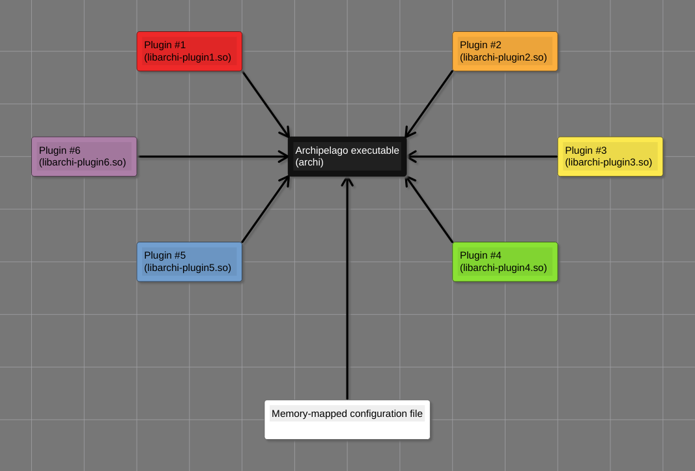
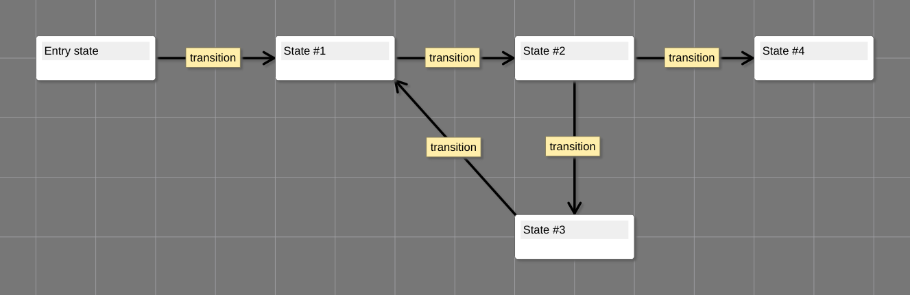

# Archipelago, a dynamic application framework

Split an application into separate reusable modules, each doing its singular purpose,
and connected at runtime using configuration in shared memory.

During the initialization phase, the Archipelago application
handles loading of plugins and execution of configuration steps,
creating contexts of resources using producer interfaces,
and providing the contexts to consumer interfaces.



During the execution phase, the Archipelago application runs the finite state machine.
Each state of this FSM is a different function that does its piece of work and chooses the next state(s).
A transition function that is called between state functions can also be specified.



The Archipelago public API consists the following parts:

* `util`: auxiliary utilities (linked lists, logging, shared memory interface, shared libraries interface, signal management interface, etc);
* `app`: application context system;
* `fsm`: finite state machine implementation;
* `exe`: general purpose executable configured via shared memory;
* `plugin`: built-in plugins providing most used types of resources:
    - `files`: opening files;
    - `shared_memory`: mapping files into memory;
    - `shared_libraries`: loading shared libraries;
    - `threads`: creating groups of threads for concurrent processing.

This application was originally designed as a part of
the [Rayway](https://github.com/ivanp7/rayway) engine to implement a command pipeline.

## The executable

1. obtains an application configuration from a memory-mapped file;
2. loads shared libraries providing plugins as specified in the configuration;
3. performs initialization instructions (creates contexts) as specified in the configuration;
4. executes a finite state machine with the specified entry state and state transition;
5. finalizes the application (destroys contexts).

All contexts are initialized and provided to consumers according to the configuration during the initialization phase.
After the initialization phase comes the execution phase, during which a finite state machine is run as described below.
The entry state and state transition of the FSM are specified by the configuration in shared memory.

## Important concepts

### Application configuration

An application configuration is a list of steps that prepare an application for execution.

A configuration step is a structure containing a type ID and type-specific data.
There are several types of configuration steps:

* `init`: create a context and add it to the application contexts;
* `final`: destroy a context and remove it from the application contexts;
* `set`: call a setter function on a context, providing it a value;
* `assign`: call a setter function on a context, providing it another context or its getter function output value;
* `act`: call an action function on a context.

### Application context interface

Context interfaces serve as very limited dynamic classes of context objects.

A context interface is a structure of pointers to the following functions:

* `init(context_ptr, config) -> status`: creates and initializes a new context according to `config`, and stores the pointer in `*context_ptr`;
* `final(context)`: finalizes and destroys `context` previously created by `init()`;
* `set(context, slot, value) -> status`: accepts `value` for internal use by `context`, the meaning of which is specified by `slot`;
* `get(context, slot, value) -> status`: retrieves data provided by `context` for `slot` to a location pointed to by `value`;
* `act(context, action, params) -> status`: invokes an internal `action` for `context` with the specified `params`.

A plugin library can provide multiple context interfaces.

### State of finite state machine

A state of a finite state machine is a triple of:
1. a pointer to a state function;
2. a `void*` pointer to state data (optional);
3. a `void*` pointer to state metadata (optional).

State functions return nothing and accept a pointer to a finite state machine context (`fsm`).
State functions can access state data and metadata via the FSM context pointer,
and also use it to manipulate the FSM state stack -- push and pop elements while initiating a state transition.

During execution, a finite state machine maintains a stack of states.
This stack is used to determine the next state during a transition -- the top element is popped and becomes the next state.

State functions initiate state transition simply by returning (no changes of stack) or by calling `fsm_proceed()` (states are popped and pushed to stack).

`fsm_proceed()` accepts the following parameters:
1. finite state machine context;
2. number of states to pop from the stack;
3. number of states to push to the stack;
4. array of states to push.

`fsm_proceed()` works not only from the state function itself, but from any nested function calls, given a valid FSM context.
If called from nested function calls, `fsm_proceed()` unwinds the call stack up to the state function via a `longjmp()`.

### Transition of finite state machine

A transition of a finite state machine is a pair of:
1. a pointer to a transition function;
2. a `void*` pointer to transition data (optional).

Transition functions return nothing and accept the following parameters:

* previous state (`prev_state`, input passed by value);
* next state (`next_state`, input passed by value);
* transitional state (`trans_state`, output passed by pointer);
* status code (`code`, input/output passed by pointer);
* pointer to transition function data (`data`).

Transition function is called:
* every time FSM state changes,
* before an entry state (`prev_state` is null),
* after an exit state (`next_state` is null).

Transition function can provide a so-called transitional state
which is immediately pushed to the stack, thus preceding the previous stack top.

Transition is hidden from state functions, which don't have any access to it.
The same transition is used between any states and cannot be changed during finite state machine execution.

# Example plugins and applications

* `plugin/sdl/` -- a plugin providing SDL2 windows and .psf2 fonts;
* [port](https://github.com/ivanp7/port) -- efficient computations on GPUs and CPUs using OpenCL;
* [still-alive](https://github.com/ivanp7/still-alive) -- a demo application.

# Documentation

Doxygen documentation is available at `docs` subdirectory. To build it, run `make`.

# How to build

0. go to the repository root directory;
1. run `configure.py` (optionally optional environment variables) to generate `build.ninja`;
2. run `ninja` to build the project.

# Build dependencies

* [ninja](https://ninja-build.org/) -- build system

# Dependencies

* [glibc](https://www.gnu.org/software/libc/) -- POSIX; argument parsing with [argp](https://www.gnu.org/software/libc/manual/html_node/Argp.html).

# License

```
   Archipelago is free software: you can redistribute it and/or modify it
   under the terms of the GNU Lesser General Public License as published
   by the Free Software Foundation, either version 3 of the License, or
   (at your option) any later version.

   Archipelago is distributed in the hope that it will be useful,
   but WITHOUT ANY WARRANTY; without even the implied warranty of
   MERCHANTABILITY or FITNESS FOR A PARTICULAR PURPOSE.  See the
   GNU Lesser General Public License for more details.

   You should have received a copy of the GNU Lesser General Public
   License along with Archipelago. If not, see <http://www.gnu.org/licenses/>.
```

